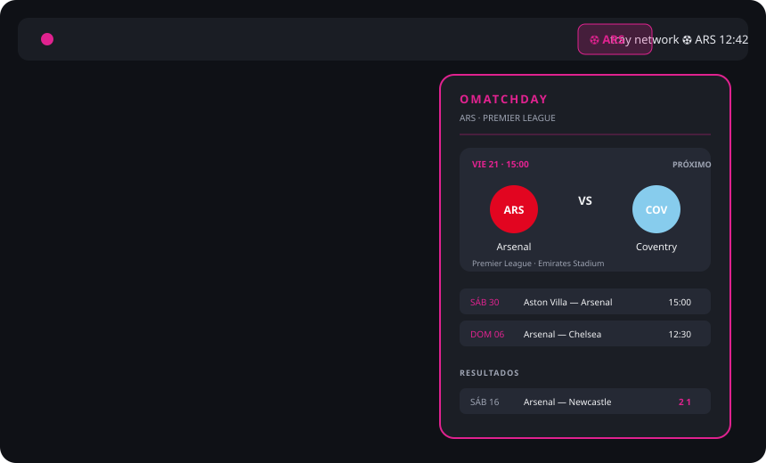

# Omatchday

Omatchday es un bar-widget de Omarchy para seguir fútbol sin invadir el escritorio. Muestra un botón en la barra superior derecha y abre el centro de partidos solo cuando lo necesitas.



## Qué hace

- Botón compacto en la barra: equipo favorito o `⚽` si todavía no hay configuración.
- Popover anclado al botón; no crea una superficie permanente sobre el escritorio.
- Convive con Agenda, Weather y el resto de los popouts de Omarchy usando la coordinación nativa de la barra.
- Próximo partido destacado con escudos, hora, competición y estadio.
- Vistas de próximos partidos, resultados y calendario mensual.
- Estados `EN VIVO`, `FINAL` y `PRÓXIMO`.
- Varios equipos y varias ligas.
- Colores derivados del tema activo y acento del equipo.
- Clic en un partido para abrir su detalle.
- Refresh manual con clic central o desde el popover.
- Caché visual del último estado mientras se actualiza la fuente.

## Instalar desde GitHub

```bash
omarchy plugin add https://github.com/brm-src/omatchday.git --enable --yes
```

O actualizar una instalación existente:

```bash
omarchy plugin update io.github.brm-src.omatchday --yes
omarchy-shell shell rescanPlugins
```

El plugin queda disponible en la lista de widgets de la barra. Si la barra no lo muestra automáticamente, agrega `io.github.brm-src.omatchday` al bloque `bar.layout.right` de `~/.config/omarchy/shell.json`.

## Configurar equipos

```bash
bash ~/.config/omarchy/plugins/io.github.brm-src.omatchday/configure-omatchday.sh
```

El asistente consulta el catálogo real de ESPN y permite escoger equipos por número. Algunos códigos de liga:

- `eng.1` — Premier League
- `esp.1` — LaLiga
- `ita.1` — Serie A
- `ger.1` — Bundesliga
- `fra.1` — Ligue 1
- `mex.1` — Liga MX
- `conmebol.libertadores` — Copa Libertadores

La configuración queda en `~/.config/omarchy/omatchday/config.json` con permisos `600`.

## Controles

- Clic izquierdo en el botón: abrir/cerrar el popover.
- Clic central: actualizar datos.
- `Esc`: cerrar.
- `Tab`: pasar al siguiente popout de la barra.
- Clic en un partido: abrir detalle en el navegador.
- En el popover: cambiar entre próximos, resultados y calendario.

## Configuración avanzada

```json
{
  "leagues": ["eng.1", "esp.1"],
  "teams": [
    {
      "id": "359",
      "name": "Arsenal",
      "shortName": "Arsenal",
      "abbreviation": "ARS",
      "logo": "https://a.espncdn.com/i/teamlogos/soccer/500/359.png",
      "color": "e20520",
      "alternateColor": "003399"
    }
  ],
  "daysBack": 45,
  "daysForward": 90,
  "refreshMinutes": 15
}
```

Omatchday consulta la API pública de ESPN vía HTTPS, sin API key, OAuth ni proxy propio. La cobertura y los límites dependen de ESPN; el plugin muestra el error en lugar de inventar datos.

## Desarrollo y validación

```bash
python3 -m unittest discover -s tests -v
python3 -m py_compile omatchday.py
qmllint -I /usr/share/omarchy/shell main.qml Panel.qml
omarchy plugin validate .
bash -n configure-omatchday.sh
git diff --check
```

## Licencia

MIT.
